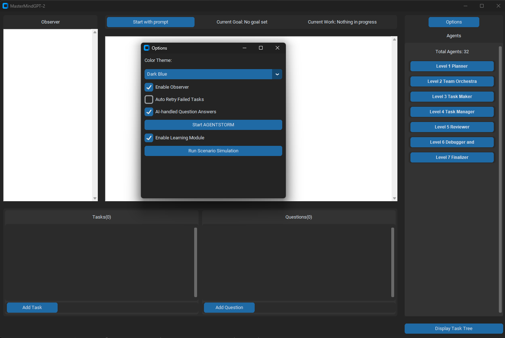

# MasterMindGPT-2
MasterMindGPT-2 is an advanced AI project management simulation tool that allows you to orchestrate complex software development processes using a team of AI agents.

## Features:

- Multi-agent system with specialized roles and expertise
- Dynamic task creation, assignment, and management
- Interactive GUI for real-time project monitoring
- Scenario simulations for different project types (Apps, Games, etc.)
- AGENTSTORM feature for creative brainstorming sessions
- Customizable project setups and agent configurations

## How to Use:

1. Run the script: `Main.py`
2. Click "Start with prompt" to begin a new project
3. Enter your project description and select the project type
4. Watch as AI agents collaborate to plan, execute, and review tasks
5. Use the GUI to monitor progress, add tasks, and interact with the system

Perfect for software developers, project managers, and AI enthusiasts looking to explore advanced project management simulations and multi-agent systems.
